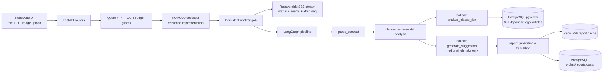

# ContractGuard

Production-grade AI engineering case study for Japanese contract risk analysis. This repository preserves the implementation as an open-source reference for LangGraph agents, RAG grounding, OCR ingestion, resilient SSE workflows, and LLMOps cost controls.

> This is a technical engineering case study, not a legal service. 本プロジェクトは技術デモであり、法律事務の取扱い・法律相談には使用できません。 本项目是技术工程案例，不是法律服务，也不能用于法律咨询。

[中文文档](./README_CN.md) | [日本語ドキュメント](./README_JA.md) | [License](./LICENSE)

## Status

Reached launch-ready state after solo development; declined commercial launch after assessing 弁護士法 Art. 72 compliance implications; cloud infrastructure intentionally decommissioned; codebase preserved as open-source engineering reference. Full local Docker flow remains functional with only an OpenAI API key. Google Cloud Vision can be configured separately for image/scanned-PDF OCR scenarios.

The Fly.io and Vercel configuration files remain in the repository as deployment references only. They describe the production topology that was built, but the hosted service has been intentionally decommissioned.

## Architecture



## Engineering Highlights

- **Multi-step LangGraph agent**: `backend/agent/graph.py` coordinates parse, risk analysis, and report generation as explicit graph nodes.
- **Tool-calling pattern**: `backend/agent/tools.py` keeps RAG lookup inside `analyze_clause_risk()` and reserves `generate_suggestion()` for medium/high-risk clauses.
- **RAG grounding**: PostgreSQL `pgvector` stores 331 Japanese legal articles from public e-Gov law data; user contracts are never embedded.
- **Recoverable streaming UX**: analysis progress is persisted through `analysis_jobs` / `analysis_events`, then replayed through `status`, `events`, and `stream?after_seq=` APIs.
- **LLMOps controls**: cost tracking, estimate-vs-actual snapshots, RAG evaluation, model signature logging, PII detection, and OCR budget guards.
- **Enterprise hardening**: RLS enforcement, webhook replay protection, rate limiting, UUID parsing guards, fail-closed OCR, startup migration locks, and structured observability hooks.
- **Multilingual frontend**: 9-language React/i18next UI with localized report shells and Japanese law citations preserved in the original text.

## Demo

The repository includes a static screenshot generated from a synthetic Japanese outsourcing contract:


Before presenting the project in an interview, run the local Docker flow and capture fresh screenshots of the review progress page and final report page from your own synthetic contract.

## Design Decisions

- **Compliance-first product call**: the system reached launch-ready depth, then the commercial launch was intentionally stopped after evaluating Japanese lawyer-law compliance risk. This is the strongest product judgment signal in the project.
- **Privacy by architecture**: full contract text is deleted after analysis, reports expire after 72 hours, and the vector database stores only public legal knowledge.
- **Operational realism**: the codebase models payment checkout, report email, cost accounting, retries, observability, and infrastructure even though those parts are now retained as reference implementations.
- **Resumable analysis over one-shot SSE**: the review flow is driven by persisted jobs/events instead of a single POST-triggered stream, so browser refreshes and network interruptions can recover state.

## Tech Stack

- Backend: FastAPI, SQLAlchemy async, Alembic, Redis, APScheduler
- Agent: LangGraph, OpenAI tool calling, clause-level analysis
- OCR: Google Cloud Vision `DOCUMENT_TEXT_DETECTION`, `pdf2image`, `poppler-utils`
- RAG: PostgreSQL `pgvector`, OpenAI embeddings
- Frontend: React, Vite, TypeScript, React Router, i18next
- Reference integrations: KOMOJU checkout, Resend email, PostHog, Sentry
- Infrastructure reference: Docker Compose, Fly.io config, Vercel config

## Quick Start

Prerequisites:

- Docker Desktop / Docker Engine
- OpenAI API key

Setup:

```bash
cp .env.example .env
# Fill OPENAI_API_KEY in .env.
# Keep APP_ENV=development for local Docker runs.
# Leave KOMOJU keys empty to use the local checkout bypass.

docker compose up --build
```

Local endpoints:

- Frontend: `http://localhost:5173`
- Backend: `http://localhost:8000`
- Health: `http://localhost:8000/api/health`

Optional OCR setup:

- Set `GOOGLE_APPLICATION_CREDENTIALS_JSON` to base64-encoded service-account JSON.
- Set `GOOGLE_VISION_PROJECT_ID`.
- Enable billing and `vision.googleapis.com` in the target GCP project.

## Local Reference Flow

1. Upload or paste a synthetic Japanese contract.
2. The upload route runs text extraction, PII checks, token estimation, non-contract detection, and optional OCR budget guards.
3. The checkout reference path creates an order. In development, empty KOMOJU credentials trigger a local bypass.
4. `/review/:orderId` starts or resumes the persistent analysis job and streams recoverable progress events.
5. LangGraph parses clauses, analyzes each clause with RAG-grounded tool calls, and generates suggestions only where risk warrants it.
6. `/report/:orderId` displays the saved report, clause excerpts, filters, and PDF generation within the 72-hour retention model.

## Data And Safety Model

- User contract text is never stored in the vector database.
- `orders.contract_text` is set to `NULL` after analysis.
- Saved reports keep only clause-level excerpts needed for report readability.
- Redis and PostgreSQL report retention are designed around a 72-hour expiry.
- OCR and preview work are protected by Redis-backed rate limits and daily budget guards.
- Startup validation fails closed in production-like environments when required credentials or RAG loading are unsafe.

## Evaluation And Regression

```bash
docker compose up -d backend postgres redis
./scripts/smoke_local_flow.sh
./scripts/check_locale_keys.sh
./scripts/check_rag_eval.sh
./scripts/run_backend_pytests.sh
```

- `scripts/smoke_local_flow.sh`: end-to-end local flow through upload, checkout reference, analysis stream, report, and contract deletion.
- `scripts/check_locale_keys.sh`: verifies that all 9 locale files match the Japanese fallback key set.
- `scripts/check_rag_eval.sh`: checks RAG Recall@5 / MRR against the local baseline.
- `scripts/run_backend_pytests.sh`: runs backend tests inside Docker.

## Repository Map

- [`backend/agent/graph.py`](./backend/agent/graph.py): LangGraph pipeline definition.
- [`backend/agent/tools.py`](./backend/agent/tools.py): tool-calling implementation for RAG risk analysis and suggestions.
- [`backend/routers/analysis.py`](./backend/routers/analysis.py): analysis start, status snapshots, historical events, and incremental event stream.
- [`backend/services/analysis_executor.py`](./backend/services/analysis_executor.py): persistent analysis executor and event persistence.
- [`backend/rag/store.py`](./backend/rag/store.py): pgvector storage and search.
- [`backend/eval/evaluator.py`](./backend/eval/evaluator.py): RAG evaluation metrics and dataset runner.
- [`backend/data/egov_laws.json`](./backend/data/egov_laws.json): public Japanese legal corpus used for RAG.
- [`backend/data/pricing_policy.json`](./backend/data/pricing_policy.json): cost policy reference data used by the checkout reference path.
- [`backend/data/komoju_payment_methods.json`](./backend/data/komoju_payment_methods.json): regional checkout-method reference data; not loaded at runtime.
- [`frontend/src/main.tsx`](./frontend/src/main.tsx): router entry, i18n, lazy route loading, deferred analytics bootstrap.
- [`frontend/src/pages/ReviewPage.tsx`](./frontend/src/pages/ReviewPage.tsx): recoverable analysis progress UI.
- [`frontend/src/pages/ReportPage.tsx`](./frontend/src/pages/ReportPage.tsx): saved report UI, risk filters, PDF action.
- [`tests/`](./tests/): backend integration and unit tests.
