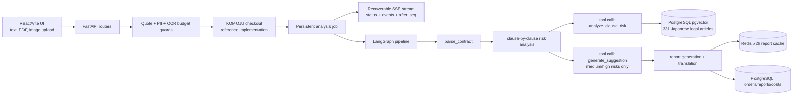

# ContractGuard

[](./LICENSE)


Japanese contract risk analysis built as an AI engineering case study — LangGraph workflow + pgvector RAG + multi-modal ingestion + recoverable streaming UX.

> ⚠️ **Not a legal service.** This repository has never been operated commercially — Japan Attorney Act §72 (弁護士法第72条) reserves paid legal advice for licensed attorneys. The codebase is published as an open-source technical artifact only. Outputs are not legal opinions.

[中文文档](./README_CN.md) | [日本語](./README_JA.md) | [License](./LICENSE)

## Status

Production-ready open-source reference implementation. The full stack — **frontend, backend, OCR, payment, email, Postgres, Redis, error tracking** — is wired with real integrations and ready to deploy. It has simply never been launched, by design (Attorney Act §72).

A synthetic Japanese contract sits in [`docs/samples/`](./docs/samples/) so the local flow can be exercised end-to-end immediately after clone.

## Architecture



## Tech Stack

| Layer | Stack |
|---|---|
| Frontend | React, Vite, TypeScript, i18next (9 languages) |
| Backend | FastAPI, SQLAlchemy async, Alembic, APScheduler |
| AI workflow | LangGraph + OpenAI tool calling, MCP server |
| RAG | PostgreSQL `pgvector`, 331 public e-Gov Japanese statutes |
| OCR | Google Cloud Vision (`DOCUMENT_TEXT_DETECTION`) |
| Storage | PostgreSQL (orders / reports / events), Redis (72h cache + rate limiting) |
| Payment | KOMOJU checkout |
| Email | Resend |
| Observability | Sentry + PostHog |
| Infra | Docker Compose (local), Fly.io + Vercel (deployment reference) |

## Quick Start (local)

Local run only requires an **OpenAI API key**.

```bash
cp .env.example .env
# Edit .env: set OPENAI_API_KEY
docker compose up --build
```

Then open <http://localhost:5173> and upload [`docs/samples/sample-contract-ja.txt`](./docs/samples/sample-contract-ja.txt).

In this minimal mode:

- ✅ Plain-text contracts and **text-based PDFs** (selectable text) work end-to-end.
- ❌ **Image / scanned-PDF OCR** is disabled. To enable it, add `GOOGLE_APPLICATION_CREDENTIALS_JSON` and `GOOGLE_VISION_PROJECT_ID`.
- KOMOJU / Resend auto-bypass in dev — no real payment, no real email.

## Production Setup

The repository is shaped to deploy to production by setting `APP_ENV=production` and supplying credentials for each external service:

| Service | Required env vars |
|---|---|
| OpenAI | `OPENAI_API_KEY` |
| Google Cloud Vision (OCR) | `GOOGLE_APPLICATION_CREDENTIALS_JSON`, `GOOGLE_VISION_PROJECT_ID` |
| KOMOJU (payment) | `KOMOJU_SECRET_KEY`, `KOMOJU_PUBLISHABLE_KEY`, `KOMOJU_WEBHOOK_SECRET` |
| Resend (email) | `RESEND_API_KEY` |
| Sentry | `SENTRY_DSN`, `VITE_SENTRY_DSN` |
| PostHog | `POSTHOG_API_KEY`, `VITE_POSTHOG_KEY` |
| Database / Cache | `DATABASE_URL` (managed Postgres + pgvector), `REDIS_URL` (managed Redis) |
| App | `FRONTEND_URL` (non-localhost), `ADMIN_API_TOKEN` |

When `APP_ENV=production`, the app **refuses to boot** if any of the above is missing or `FRONTEND_URL` still points at localhost. Strict-validation logic lives in [`backend/config.py`](./backend/config.py) (`validate_runtime()`).

`fly.toml` and `vercel.json` describe the deployment topology used during development. The service is not currently hosted.

## Flow

1. Upload a contract (text, PDF, or image). The upload route runs text extraction, PII checks, token estimation, non-contract detection, and OCR budget guards.
2. Checkout reference path creates an order. Empty KOMOJU credentials trigger a local bypass in dev.
3. `/review/:orderId` starts or resumes the persistent analysis job and streams progress events that survive page refresh.
4. LangGraph parses clauses, analyzes each clause with RAG-grounded tool calls, and generates suggestions only where the risk warrants it.
5. `/report/:orderId` shows the saved report, clause excerpts, risk filters, and PDF export — retained for 72 hours.

User contract text is deleted after analysis. The vector store contains only public e-Gov statutes; user contracts are never embedded.

## Demo


## Repository Map

- [`backend/agent/graph.py`](./backend/agent/graph.py) — LangGraph pipeline.
- [`backend/agent/tools.py`](./backend/agent/tools.py) — RAG-grounded tool calls.
- [`backend/services/analysis_executor.py`](./backend/services/analysis_executor.py) — persistent analysis job + event sourcing.
- [`backend/rag/store.py`](./backend/rag/store.py) — pgvector storage and search.
- [`backend/config.py`](./backend/config.py) — runtime configuration and strict validation.
- [`frontend/src/pages/ReviewPage.tsx`](./frontend/src/pages/ReviewPage.tsx) — recoverable analysis progress UI.
- [`frontend/src/pages/ReportPage.tsx`](./frontend/src/pages/ReportPage.tsx) — report UI with risk filters and PDF export.
- [`tests/`](./tests/) — backend pytest suites.
- [`scripts/smoke_local_flow.sh`](./scripts/smoke_local_flow.sh) — end-to-end local smoke test.
