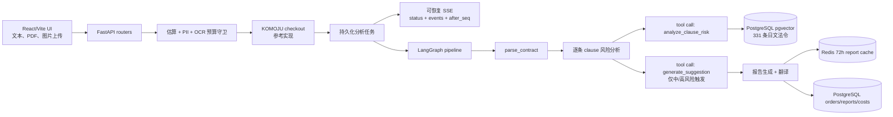
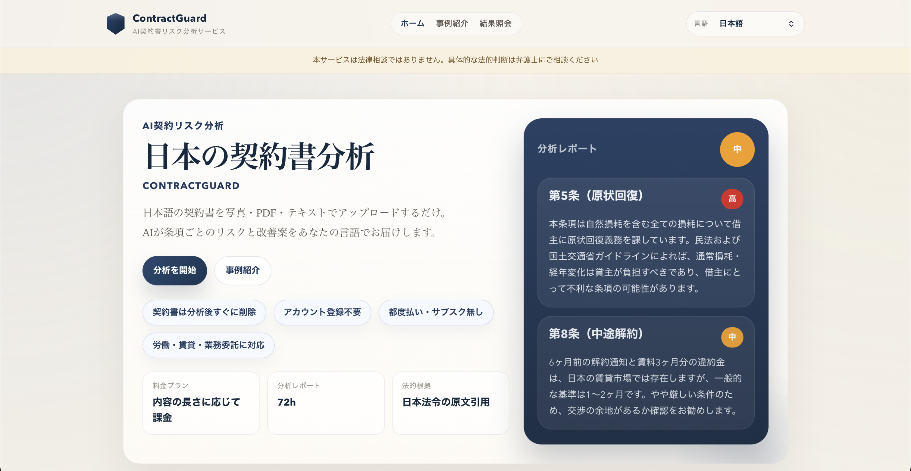
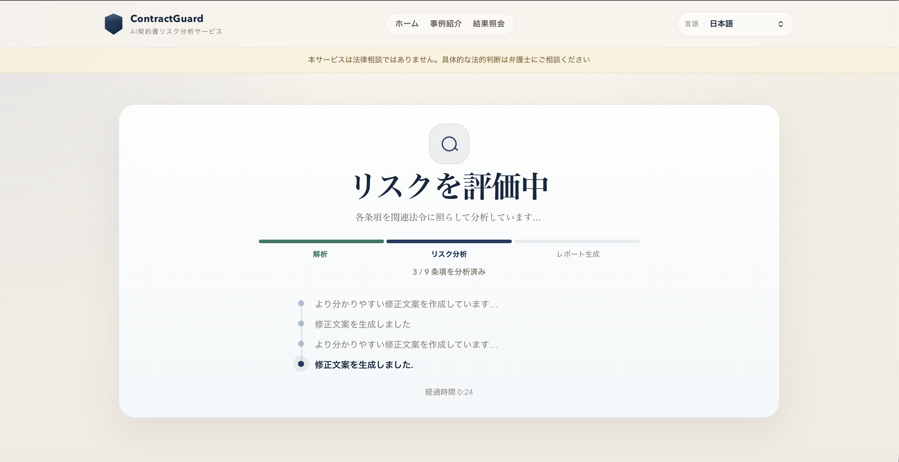
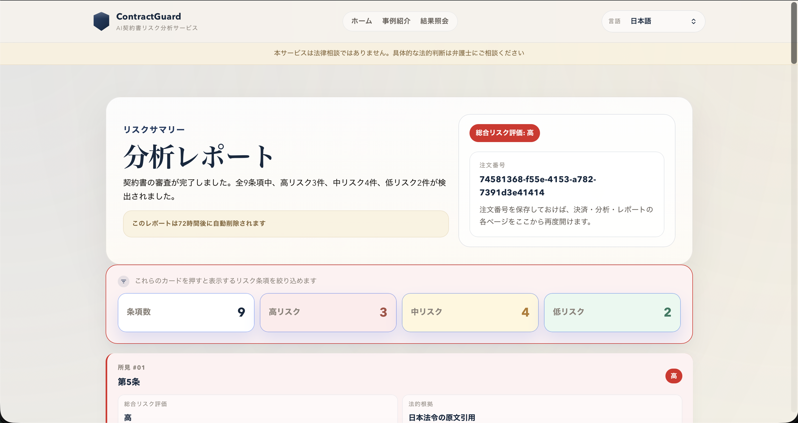

# ContractGuard

[](./LICENSE)


面向日文合同风险分析场景的 production-grade AI 工程案例。这个仓库以开源 reference implementation 的形式保留了 LangGraph Agent、RAG grounding、OCR ingestion、可恢复 SSE 流程以及 LLMOps 成本控制等完整工程实践。

> This is a technical engineering case study, not a legal service. 本プロジェクトは技術デモであり、法律事務の取扱い・法律相談には使用できません。 本项目是技术工程案例，不是法律服务，也不能用于法律咨询。

[English](./README.md) | [日本語ドキュメント](./README_JA.md) | [License](./LICENSE)

## 当前状态

Reached launch-ready state after solo development; declined commercial launch after assessing 弁護士法 Art. 72 compliance implications; cloud infrastructure intentionally decommissioned; codebase preserved as open-source engineering reference. Full local Docker flow remains functional with only an OpenAI API key. 如需测试图片 / 扫描 PDF OCR，可额外配置 Google Cloud Vision。

`fly.toml` 和 `vercel.json` 仅作为部署拓扑参考保留。它们展示曾经搭好的生产基础设施形态，但线上服务已主动下线，不代表当前仍在运营或招募用户。

## 架构



## Engineering Highlights

- **Multi-step LangGraph Agent**：`backend/agent/graph.py` 将合同解析、逐条风险分析、报告生成拆成明确节点。
- **Tool-calling pattern**：`backend/agent/tools.py` 把 RAG 检索封装在 `analyze_clause_risk()` 内部，`generate_suggestion()` 只服务中/高风险条款。
- **RAG grounding**：PostgreSQL `pgvector` 存储 331 条公开 e-Gov 日文法条，用户合同永不进入向量库。
- **可恢复流式体验**：`analysis_jobs` / `analysis_events` 持久化进度，再通过 `status`、`events`、`stream?after_seq=` 恢复。
- **LLMOps**：成本追踪、estimate-vs-actual 快照、RAG eval、模型签名日志、PII 检测、OCR 预算守卫。
- **Enterprise hardening**：RLS、webhook replay protection、rate limiting、UUID guard、fail-closed OCR、启动迁移锁、结构化观测。
- **9 语言前端**：React/i18next 多语言 UI，报告壳层本地化，引用法条保持日文原文。

## Demo

仓库包含三张基于合成日文合同生成的运行截图：





## Design Decisions

- **合规优先**：项目达到 launch-ready 深度后，因评估弁護士法 Art. 72 相关影响，主动放弃商业上线。这是该项目最重要的产品判断信号。
- **隐私优先架构**：完整合同正文分析后删除，报告 72 小时过期，向量库只保存公开法令知识。
- **真实工程闭环**：虽然现在是开源参考项目，代码仍保留 checkout、邮件、成本核算、重试、观测和部署配置等工程接口。
- **持久化事件流**：审查流程不是一次性 POST SSE，而是可恢复任务 + 事件回放，能承受刷新和短暂断网。

## 技术栈

- 后端：FastAPI、SQLAlchemy async、Alembic、Redis、APScheduler
- Agent：LangGraph、OpenAI tool calling、逐条 clause 分析
- OCR：Google Cloud Vision `DOCUMENT_TEXT_DETECTION`、`pdf2image`、`poppler-utils`
- RAG：PostgreSQL `pgvector`、OpenAI embeddings
- 前端：React、Vite、TypeScript、React Router、i18next
- 参考集成：KOMOJU checkout、Resend email、PostHog、Sentry
- 基础设施参考：Docker Compose、Fly.io config、Vercel config

## 快速开始

前置条件：

- Docker Desktop / Docker Engine
- OpenAI API Key

启动：

```bash
cp .env.example .env
# 在 .env 中填写 OPENAI_API_KEY。
# 本地 Docker 保持 APP_ENV=development。
# KOMOJU keys 留空即可走本地 checkout bypass。

docker compose up --build
```

本地地址：

- 前端：`http://localhost:5173`
- 后端：`http://localhost:8000`
- 健康检查：`http://localhost:8000/api/health`

可选 OCR 配置：

- `GOOGLE_APPLICATION_CREDENTIALS_JSON` 写入 base64 后的 service-account JSON。
- 配置 `GOOGLE_VISION_PROJECT_ID`。
- 在目标 GCP 项目启用 Billing 和 `vision.googleapis.com`。

## 本地参考流程

1. 上传或粘贴一份合成日文合同。
2. upload route 执行文本提取、PII 检测、token 估算、非合同判定和可选 OCR 预算守卫。
3. checkout reference path 创建订单；开发环境下 KOMOJU 凭据为空会走本地 bypass。
4. `/review/:orderId` 启动或恢复持久化分析任务，并接收可恢复进度事件。
5. LangGraph 解析条款、逐条执行 RAG-grounded tool call，并只对必要条款生成建议。
6. `/report/:orderId` 展示报告、条款摘录、风险筛选和 PDF 生成动作。

## 数据与安全模型

- 用户合同正文永不写入向量数据库。
- 分析完成后 `orders.contract_text` 置为 `NULL`。
- 72 小时报告只保留理解报告所需的 clause 级原文摘录。
- Redis / PostgreSQL 报告保存模型围绕 72 小时过期设计。
- OCR 和 preview 路径有 Redis 速率限制与日级预算守卫。
- production-like 环境中关键凭据、RAG 加载或安全配置异常会 fail closed。

## 验证

```bash
docker compose up -d backend postgres redis
./scripts/smoke_local_flow.sh
./scripts/check_locale_keys.sh
./scripts/check_rag_eval.sh
./scripts/run_backend_pytests.sh
```

- `scripts/smoke_local_flow.sh`：覆盖 upload、checkout reference、analysis stream、report、contract deletion。
- `scripts/check_locale_keys.sh`：检查 9 语言 locale key 与日文 fallback 一致。
- `scripts/check_rag_eval.sh`：检查 RAG Recall@5 / MRR 基线。
- `scripts/run_backend_pytests.sh`：在 Docker 内运行后端测试。

## 仓库入口

- [`backend/agent/graph.py`](./backend/agent/graph.py)：LangGraph pipeline。
- [`backend/agent/tools.py`](./backend/agent/tools.py)：RAG 风险分析与建议生成工具。
- [`backend/routers/analysis.py`](./backend/routers/analysis.py)：分析启动、状态快照、历史事件和增量事件流。
- [`backend/services/analysis_executor.py`](./backend/services/analysis_executor.py)：持久化分析执行器。
- [`backend/rag/store.py`](./backend/rag/store.py)：pgvector 存储与检索。
- [`backend/eval/evaluator.py`](./backend/eval/evaluator.py)：RAG 评估。
- [`backend/data/egov_laws.json`](./backend/data/egov_laws.json)：公开日文法令语料。
- [`backend/data/pricing_policy.json`](./backend/data/pricing_policy.json)：checkout reference path 使用的成本策略参考数据。
- [`backend/data/komoju_payment_methods.json`](./backend/data/komoju_payment_methods.json)：区域 checkout method 参考数据，运行时不加载。
- [`frontend/src/pages/ReviewPage.tsx`](./frontend/src/pages/ReviewPage.tsx)：可恢复分析进度 UI。
- [`frontend/src/pages/ReportPage.tsx`](./frontend/src/pages/ReportPage.tsx)：报告、风险筛选和 PDF 动作。
- [`tests/`](./tests/)：后端集成测试与单元测试。
