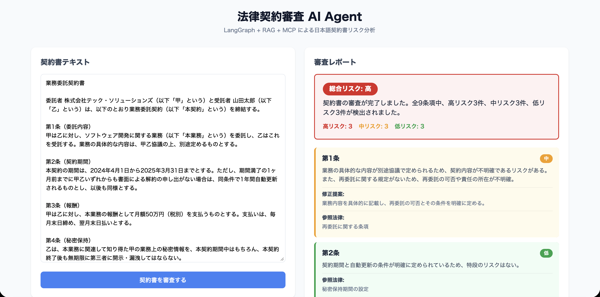

# 法律合同审查 AI Agent

基于 LangGraph、RAG、MCP 和 Tool Calling 构建的日文法律合同智能审查系统。

[English](./README.md) | [日本語ドキュメント](./README_JA.md)

## 运行效果



## 系统架构

```
┌─────────────┐    ┌──────────────────────────────────────────┐
│  React UI   │───▶│  FastAPI 后端                             │
└─────────────┘    │                                          │
                   │  LangGraph Agent 工作流:                   │
┌─────────────┐    │  解析合同 → 知识检索 → 风险分析 → 生成报告    │
│ Claude       │    │                                          │
│ Desktop     │───▶│  工具: search_legal_knowledge             │
│ (MCP 客户端) │    │        analyze_clause_risk               │
└─────────────┘    │        generate_suggestion               │
                   │                                          │
                   │  RAG: ChromaDB + OpenAI Embeddings       │
                   └──────────────────────────────────────────┘
```

## 技术栈

- **LLM**: OpenAI GPT-4o
- **Agent 框架**: LangGraph (StateGraph)
- **RAG**: ChromaDB + text-embedding-3-small
- **MCP**: FastMCP (Python)
- **后端**: FastAPI
- **前端**: React + Vite + TypeScript
- **部署**: Docker Compose

## 快速开始

### 前置条件

- Docker & Docker Compose
- OpenAI API Key

### 启动

```bash
cd legal-contract-agent

# 从模板创建 .env 文件，填入 OpenAI API Key
cp .env.example .env
# 编辑 .env: OPENAI_API_KEY=sk-your-key-here

# 构建并启动所有服务
docker compose up --build
```

打开 http://localhost:5173 — 粘贴日文合同，点击「契約書を審査する」。

停止服务：

```bash
docker compose down        # 停止容器
docker compose down -v     # 停止并删除数据卷
```

### 不使用 Docker 运行（可选）

```bash
# 安装 Python 依赖
pip install .

# 安装前端依赖
cd frontend && npm install && cd ..

# 终端 1：启动后端
uvicorn backend.main:app --reload

# 终端 2：启动前端
cd frontend && npm run dev
```

### MCP Server（用于 Claude Desktop）

```bash
python -m backend.mcp.server
```

添加到 Claude Desktop 配置：

```json
{
  "mcpServers": {
    "legal-review": {
      "command": "python",
      "args": ["-m", "backend.mcp.server"],
      "cwd": "/path/to/legal-contract-agent"
    }
  }
}
```

## 项目结构

```
backend/
├── main.py              # FastAPI 入口
├── Dockerfile           # 后端容器镜像
├── agent/
│   ├── graph.py         # LangGraph 工作流定义
│   ├── nodes.py         # Agent 节点逻辑
│   ├── state.py         # Agent 状态定义
│   └── tools.py         # LangChain 工具
├── rag/
│   ├── store.py         # ChromaDB 向量存储
│   └── loader.py        # 知识加载器
├── mcp/
│   └── server.py        # MCP 服务端
└── data/
    └── legal_knowledge.json  # 法律知识库（20条）

frontend/
├── Dockerfile           # 前端容器镜像
└── src/
    ├── App.tsx           # 主页面
    └── App.css           # 样式

docker-compose.yml       # 容器编排
```

## 核心设计思路

- **为什么用 LangGraph 而不是简单的 Chain**：支持条件分支、状态管理，可扩展为多 Agent 协作
- **RAG 的价值**：让 Agent 的回答基于可靠的法律知识库，而非纯靠 LLM 记忆
- **MCP 的意义**：标准化 AI 工具协议，任意客户端（Claude Desktop 等）都能调用合同审查能力
- **Tool Calling**：Agent 自主决定何时调用什么工具，体现自主决策能力
