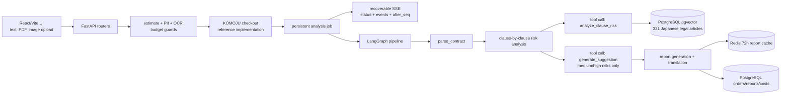

# ContractGuard

日本語契約リスク分析を題材にした production-grade AI engineering case study です。LangGraph agent、RAG grounding、OCR ingestion、復元可能な SSE フロー、LLMOps のコスト管理を含む実装を、オープンソースの reference implementation として保存しています。

> This is a technical engineering case study, not a legal service. 本プロジェクトは技術デモであり、法律事務の取扱い・法律相談には使用できません。 本项目是技术工程案例，不是法律服务，也不能用于法律咨询。

[English](./README.md) | [中文文档](./README_CN.md) | [License](./LICENSE)

## 現在の状態

Reached launch-ready state after solo development; declined commercial launch after assessing 弁護士法 Art. 72 compliance implications; cloud infrastructure intentionally decommissioned; codebase preserved as open-source engineering reference. Full local Docker flow remains functional with only an OpenAI API key. 画像 / スキャン PDF OCR を確認する場合のみ、Google Cloud Vision を追加設定できます。

`fly.toml` と `vercel.json` はデプロイ構成の参考として残しています。過去に構築した production topology を示すためのもので、ホストされたサービスは意図的に停止済みです。

## アーキテクチャ



## Engineering Highlights

- **Multi-step LangGraph Agent**: `backend/agent/graph.py` が parse、risk analysis、report generation を明示的な graph node として構成します。
- **Tool-calling pattern**: `backend/agent/tools.py` は RAG lookup を `analyze_clause_risk()` 内に閉じ込め、`generate_suggestion()` を中/高リスク条項だけに使います。
- **RAG grounding**: PostgreSQL `pgvector` に e-Gov 由来の公開法令 331 条を保存し、ユーザー契約は embedding しません。
- **Recoverable streaming UX**: `analysis_jobs` / `analysis_events` に進捗を永続化し、`status`、`events`、`stream?after_seq=` で復元します。
- **LLMOps controls**: cost tracking、estimate-vs-actual snapshots、RAG evaluation、model signature logging、PII detection、OCR budget guards。
- **Enterprise hardening**: RLS enforcement、webhook replay protection、rate limiting、UUID guards、fail-closed OCR、startup migration locks、structured observability。
- **Multilingual frontend**: 9 言語 React/i18next UI。レポートの UI は翻訳しつつ、引用法令は日本語原文を保持します。

## Demo

合成した日本語の業務委託契約から生成した静的スクリーンショットを同梱しています。


面接で使う前に、ローカル Docker フローを実行し、自分の合成契約で review progress page と final report page を撮り直すことを推奨します。

## Design Decisions

- **Compliance-first product call**: launch-ready まで作り込んだ後、弁護士法 Art. 72 の含意を評価し、commercial launch を止めました。これは本プロジェクトの重要な product judgment signal です。
- **Privacy by architecture**: 契約全文は分析後に削除し、レポートは 72 時間で期限切れ、ベクトル DB には公開法令だけを保存します。
- **Operational realism**: 現在はオープンソース参考実装ですが、checkout、email、cost accounting、retry、observability、deployment config まで実運用前提で設計しています。
- **Resumable analysis**: 一回限りの POST SSE ではなく、永続化 job/event と event replay で refresh や一時的な接続断に耐えます。

## 技術スタック

- Backend: FastAPI, SQLAlchemy async, Alembic, Redis, APScheduler
- Agent: LangGraph, OpenAI tool calling, clause-level analysis
- OCR: Google Cloud Vision `DOCUMENT_TEXT_DETECTION`, `pdf2image`, `poppler-utils`
- RAG: PostgreSQL `pgvector`, OpenAI embeddings
- Frontend: React, Vite, TypeScript, React Router, i18next
- Reference integrations: KOMOJU checkout, Resend email, PostHog, Sentry
- Infrastructure reference: Docker Compose, Fly.io config, Vercel config

## クイックスタート

前提:

- Docker Desktop / Docker Engine
- OpenAI API key

起動:

```bash
cp .env.example .env
# .env に OPENAI_API_KEY を設定します。
# ローカル Docker では APP_ENV=development のままにします。
# KOMOJU keys を空にすると local checkout bypass を使います。

docker compose up --build
```

ローカル URL:

- Frontend: `http://localhost:5173`
- Backend: `http://localhost:8000`
- Health: `http://localhost:8000/api/health`

任意の OCR 設定:

- `GOOGLE_APPLICATION_CREDENTIALS_JSON` に service-account JSON の base64 を設定。
- `GOOGLE_VISION_PROJECT_ID` を設定。
- 対象 GCP project で Billing と `vision.googleapis.com` を有効化。

## ローカル参考フロー

1. 合成した日本語契約をアップロード、またはテキスト貼り付けします。
2. upload route が text extraction、PII check、token estimate、non-contract detection、任意の OCR budget guard を実行します。
3. checkout reference path が order を作成します。development で KOMOJU credentials が空の場合は local bypass になります。
4. `/review/:orderId` が persistent analysis job を開始または復元し、進捗 event を受け取ります。
5. LangGraph が clause を解析し、RAG-grounded tool call で条項ごとに分析し、必要な場合だけ suggestion を生成します。
6. `/report/:orderId` が report、clause excerpts、risk filter、PDF action を表示します。

## データと安全性

- ユーザー契約本文は vector database に保存しません。
- 分析完了後、`orders.contract_text` は `NULL` になります。
- 72 時間 report には読解に必要な clause-level excerpt だけを保持します。
- Redis / PostgreSQL の report retention は 72 時間 expiry を前提に設計されています。
- OCR / preview path は Redis rate limit と daily budget guard で保護します。
- production-like environment では、重要 credential、RAG loading、security config が不安全な場合に fail closed します。

## 検証

```bash
docker compose up -d backend postgres redis
./scripts/smoke_local_flow.sh
./scripts/check_locale_keys.sh
./scripts/check_rag_eval.sh
./scripts/run_backend_pytests.sh
```

- `scripts/smoke_local_flow.sh`: upload、checkout reference、analysis stream、report、contract deletion を通します。
- `scripts/check_locale_keys.sh`: 9 言語 locale key が Japanese fallback と一致するか確認します。
- `scripts/check_rag_eval.sh`: RAG Recall@5 / MRR baseline を確認します。
- `scripts/run_backend_pytests.sh`: Docker 内で backend tests を実行します。

## 主要ファイル

- [`backend/agent/graph.py`](./backend/agent/graph.py): LangGraph pipeline。
- [`backend/agent/tools.py`](./backend/agent/tools.py): RAG risk analysis と suggestion の tool 実装。
- [`backend/routers/analysis.py`](./backend/routers/analysis.py): analysis start、status snapshots、historical events、incremental stream。
- [`backend/services/analysis_executor.py`](./backend/services/analysis_executor.py): persistent analysis executor。
- [`backend/rag/store.py`](./backend/rag/store.py): pgvector storage and search。
- [`backend/eval/evaluator.py`](./backend/eval/evaluator.py): RAG evaluation。
- [`backend/data/egov_laws.json`](./backend/data/egov_laws.json): 公開日本法令 corpus。
- [`backend/data/pricing_policy.json`](./backend/data/pricing_policy.json): checkout reference path 用の cost policy reference data。
- [`backend/data/komoju_payment_methods.json`](./backend/data/komoju_payment_methods.json): regional checkout-method reference data。runtime では読み込みません。
- [`frontend/src/pages/ReviewPage.tsx`](./frontend/src/pages/ReviewPage.tsx): recoverable analysis progress UI。
- [`frontend/src/pages/ReportPage.tsx`](./frontend/src/pages/ReportPage.tsx): report、risk filter、PDF action。
- [`tests/`](./tests/): backend integration / unit tests。
