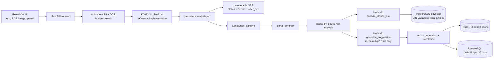

# ContractGuard

[](./LICENSE)


日本語契約のリスク分析を題材にした AI engineering case study —— LangGraph workflow + pgvector RAG + マルチモーダル入力 + 復元可能なストリーミング UX。

> ⚠️ **法律サービスではありません。** 本リポジトリは商用サービスとして運用された実績はありません —— 弁護士法第 72 条が有償の法律相談を弁護士の独占業務と定めているため、本プロジェクトはオープンソースの技術 artifact として公開しているのみです。出力は法的見解ではありません。

[English](./README.md) | [中文文档](./README_CN.md) | [License](./LICENSE)

## ステータス

production-ready レベルのオープンソース reference implementation です。**フロントエンド、バックエンド、OCR、決済、メール、Postgres、Redis、エラートラッキング** —— スタック全体が実 integration で接続済みで、いつでもデプロイ可能な状態です。ただし弁護士法第 72 条の制約により、商用ローンチは一度も実施していません（by design）。

[`docs/samples/`](./docs/samples/) に合成日本語契約サンプルを同梱しているため、clone 直後に end-to-end フローを試せます。

## アーキテクチャ



## 技術スタック

| レイヤー | スタック |
|---|---|
| Frontend | React, Vite, TypeScript, i18next（9 言語） |
| Backend | FastAPI, SQLAlchemy async, Alembic, APScheduler |
| AI workflow | LangGraph + OpenAI tool calling, MCP server |
| RAG | PostgreSQL `pgvector`、331 条 公開 e-Gov 日本法令 |
| OCR | Google Cloud Vision（`DOCUMENT_TEXT_DETECTION`） |
| ストレージ | PostgreSQL（orders / reports / events）、Redis（72h cache + rate limiting） |
| 決済 | KOMOJU checkout |
| メール | Resend |
| 観測 | Sentry + PostHog |
| インフラ | Docker Compose（ローカル）、Fly.io + Vercel（デプロイ参考） |

## ローカル起動

ローカル実行に必要なのは **OpenAI API key** だけです。

```bash
cp .env.example .env
# .env を編集：OPENAI_API_KEY を設定
docker compose up --build
```

続いて <http://localhost:5173> を開き、[`docs/samples/sample-contract-ja.txt`](./docs/samples/sample-contract-ja.txt) をアップロードするだけで試せます。

最小構成で動くもの:

- ✅ プレーンテキスト契約と**テキスト型 PDF**（テキスト選択可能な PDF）が end-to-end で動作。
- ❌ **画像 / スキャン PDF の OCR** は無効化されています。利用するには `GOOGLE_APPLICATION_CREDENTIALS_JSON` と `GOOGLE_VISION_PROJECT_ID` を設定してください。
- dev モードで KOMOJU / Resend は自動 bypass —— 実課金もメール送信もありません。

## 本番セットアップ

本リポジトリは production デプロイ可能な形に仕上がっており、`APP_ENV=production` を指定したうえで各外部サービスの認証情報を設定するだけで動きます。

| サービス | 必須の環境変数 |
|---|---|
| OpenAI | `OPENAI_API_KEY` |
| Google Cloud Vision（OCR） | `GOOGLE_APPLICATION_CREDENTIALS_JSON`、`GOOGLE_VISION_PROJECT_ID` |
| KOMOJU（決済） | `KOMOJU_SECRET_KEY`、`KOMOJU_PUBLISHABLE_KEY`、`KOMOJU_WEBHOOK_SECRET` |
| Resend（メール） | `RESEND_API_KEY` |
| Sentry | `SENTRY_DSN`、`VITE_SENTRY_DSN` |
| PostHog | `POSTHOG_API_KEY`、`VITE_POSTHOG_KEY` |
| DB / キャッシュ | `DATABASE_URL`（managed Postgres + pgvector）、`REDIS_URL`（managed Redis） |
| アプリ | `FRONTEND_URL`（localhost 不可）、`ADMIN_API_TOKEN` |

`APP_ENV=production` のとき、上記いずれかが空、または `FRONTEND_URL` が localhost のままの場合、アプリは**起動を拒否**します。厳格な検証ロジックは [`backend/config.py`](./backend/config.py) の `validate_runtime()` を参照。

`fly.toml` と `vercel.json` は開発時に使用したデプロイ topology の参考です。現在 hosted されているサービスはありません。

## フロー

1. 契約をアップロード（テキスト / PDF / 画像）。upload route が text extraction、PII チェック、token 見積、non-contract 判定、OCR 予算ガードを実行。
2. checkout 参考フローが order を作成。dev で KOMOJU credentials が空ならローカル bypass。
3. `/review/:orderId` が persistent analysis job を開始または再開し、ページ refresh に耐える進捗 event を流す。
4. LangGraph が条項を解析し、RAG-grounded tool call で条項ごとに分析、必要な箇所のみ suggestion を生成。
5. `/report/:orderId` が report、clause excerpts、リスクフィルタ、PDF 出力を表示（72 時間保持）。

ユーザー契約本文は分析後に削除されます。vector store には公開 e-Gov 法令のみを格納し、ユーザー契約は embedding しません。

## Demo


## リポジトリマップ

- [`backend/agent/graph.py`](./backend/agent/graph.py) —— LangGraph pipeline。
- [`backend/agent/tools.py`](./backend/agent/tools.py) —— RAG-grounded tool calls。
- [`backend/services/analysis_executor.py`](./backend/services/analysis_executor.py) —— persistent analysis job + event sourcing。
- [`backend/rag/store.py`](./backend/rag/store.py) —— pgvector ストレージと検索。
- [`backend/config.py`](./backend/config.py) —— ランタイム設定と厳格検証。
- [`frontend/src/pages/ReviewPage.tsx`](./frontend/src/pages/ReviewPage.tsx) —— 復元可能な進捗 UI。
- [`frontend/src/pages/ReportPage.tsx`](./frontend/src/pages/ReportPage.tsx) —— レポート UI（リスクフィルタ、PDF 出力）。
- [`tests/`](./tests/) —— backend pytest スイート。
- [`scripts/smoke_local_flow.sh`](./scripts/smoke_local_flow.sh) —— end-to-end ローカルスモークテスト。
